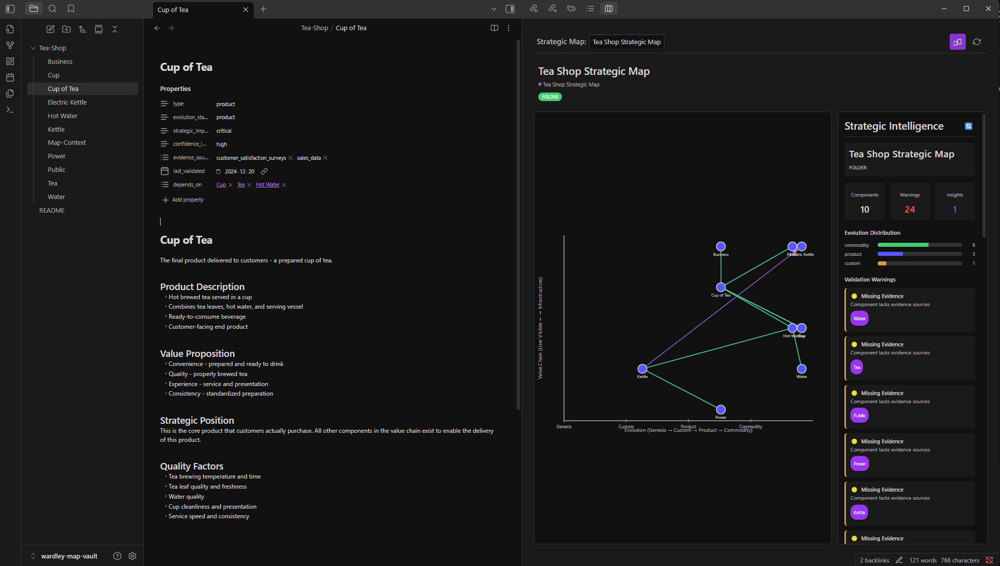
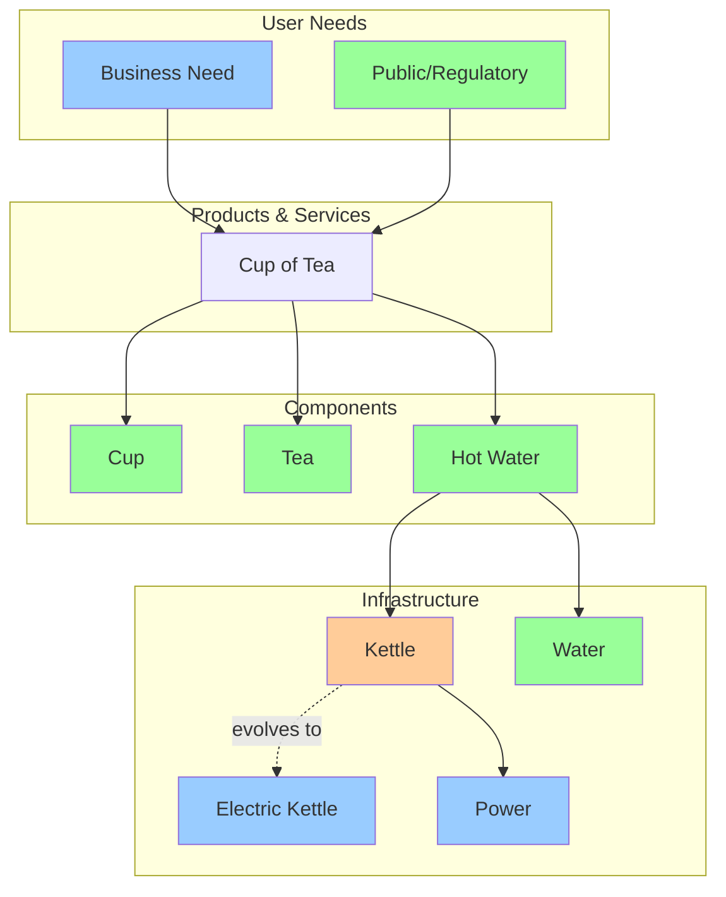

# Breadcrumbs V4 - Strategic Mapping Extension

An extension to [Breadcrumbs V4](https://github.com/SkepticMystic/breadcrumbs/tree/v4) that adds strategic mapping capabilities to Obsidian, enabling you to create and visualize Wardley Maps directly from your notes.

## 🙏 Attribution

This project is built on and extends the excellent [Breadcrumbs plugin](https://github.com/SkepticMystic/breadcrumbs) by [SkepticMystic](https://github.com/SkepticMystic) and the Breadcrumbs community. All core graph functionality, relationship management, and plugin architecture comes from the original Breadcrumbs V4 codebase.

**Original Breadcrumbs Repository**: https://github.com/SkepticMystic/breadcrumbs/tree/v4

This strategic mapping extension adds Wardley mapping visualization on top of Breadcrumbs' powerful relationship and hierarchy system.

## 🎨 Visual Preview


*Interactive Wardley Map showing the Tea Shop example with component positioning, relationship arrows, and evolution progression*

## 🎯 What is Strategic Mapping?

Strategic mapping helps you visualize and analyze the evolution and dependencies of components in your business, technology, or knowledge domain. This extension implements [Wardley Mapping](https://wardleymaps.com/) methodology within Obsidian, allowing you to:

- **Map value chains** and component dependencies
- **Visualize evolution stages** from genesis to commodity
- **Analyze strategic positioning** and competitive landscapes  
- **Track component relationships** and evolution over time
- **Generate insights** about your strategic landscape

## 🚀 Features

### ✅ Core Capabilities
- **Interactive Wardley Maps** with real-time positioning
- **Strategic YAML frontmatter** for component metadata
- **Auto-refresh** - maps update immediately when you edit notes
- **Multiple relationship types**:
  - `depends_on` - value chain dependencies (blue lines)
  - `enables` - what this component enables (green lines) 
  - `evolves_to/evolved_from` - technological evolution (purple dotted arrows)
- **Evolution stages**: Genesis → Custom → Product → Commodity
- **Strategic intelligence panel** with automated analysis and evidence validation
- **Map contexts** for organizing different strategic domains
- **Folder-based organization** - any folder can be a strategic map
- **Visual customization** - configurable fonts, node sizes, colors, and grid lines

### 📊 Visual Elements
- **Component positioning** based on evolution stage (X-axis) and value chain (Y-axis)
- **Relationship arrows** with different colors and styles
- **Evolution arrows** with directional arrow heads
- **Strategic importance** indicated by component colors
- **Interactive components** - click to open notes
- **Evolution grid lines** - optional dotted lines showing stage boundaries
- **Customizable styling** - fonts, node sizes, colors, spacing, and line thickness

### 🎨 Visual Customization
Access visual settings through **Settings > Breadcrumbs > Wardley Maps**:
- **Font size** - adjust label text size (8-20px)
- **Node size** - component circle radius (8-24px) 
- **Component spacing** - horizontal spacing between components (40-150px)
- **Strategic importance colors** - custom colors for critical/important/supporting components
- **Evolution grid lines** - toggle dotted vertical lines for evolution stages
- **Edge thickness** - relationship line width (1-5px)
- **Grid appearance** - color and opacity of evolution stage boundaries

## 📋 Requirements

- **Obsidian** (latest version recommended)
- **Breadcrumbs V4 plugin** (this is an extension of Breadcrumbs)

## 🛠️ Installation

1. **Clone or download** this repository
2. **Copy the built plugin** to your Obsidian vault's `.obsidian/plugins/breadcrumbs/` directory
3. **Enable the plugin** in Obsidian settings
4. **Open Wardley Map view** using `Ctrl+Shift+P` → "Open Wardley Map view"

## 🏗️ Usage

### Basic Strategic Component Setup

Add strategic metadata to your note's YAML frontmatter:

```yaml
---
type: component
evolution_stage: product
strategic_importance: critical
confidence_level: high
evidence_sources:
  - "[[Market Research Report]]"
  - "[[Customer Feedback Survey]]"
last_validated: "2024-12-15"
depends_on:
  - "[[Database]]"
  - "[[API Gateway]]"
enables:
  - "[[User Dashboard]]"
---

# User Authentication

This component handles user login and authorization...
```

### Strategic Attributes

| Attribute | Values | Description |
|-----------|--------|-------------|
| `type` | `component`, `capability`, `service`, `user_need`, `product` | Type of strategic element |
| `evolution_stage` | `genesis`, `custom`, `product`, `commodity` | How evolved/mature this component is |
| `strategic_importance` | `critical`, `important`, `supporting` | Business importance level |
| `confidence_level` | `high`, `medium`, `low` | How confident you are in this assessment |
| `depends_on` | List of `[[links]]` | Components this depends on (value chain) |
| `enables` | List of `[[links]]` | Components this enables |
| `evolves_to` | List of `[[links]]` | What this component evolves into |
| `evolved_from` | List of `[[links]]` | What this component evolved from |

### Relationship Types

#### Value Chain Relationships (Vertical positioning)
- **`depends_on`**: Components this element requires (positioned below)
- **`enables`**: Components this element enables (positioned above)

#### Evolution Relationships (Horizontal arrows)  
- **`evolves_to`**: Shows technological evolution direction (A → B)
- **`evolved_from`**: Reverse evolution relationship (B ← A)

### Evolution Stages (Left to Right)

1. **Genesis** - Novel, uncertain, rapidly changing
2. **Custom** - Becoming understood, custom-built solutions
3. **Product** - Standardized products, best practices emerging  
4. **Commodity** - Standardized, utility-like, stable

## 📂 Map Organization

### Folder-Based Maps
Any folder containing components with strategic metadata automatically becomes a map context:

```
📁 Tea-Shop/          # ← This becomes a strategic map
  ├── Cup.md          # Component: evolution_stage: commodity
  ├── Tea.md          # Component: evolution_stage: commodity  
  ├── Kettle.md       # Component: evolution_stage: custom
  └── Power.md        # Service: evolution_stage: product
```

### Map Selection
Use the map selector dropdown to switch between different strategic contexts:
- **Infrastructure Strategy** 
- **Product Strategy**
- **Tea Shop** (example)
- **Any folder** with strategic components

## 🍵 Example: Tea Shop Wardley Map

The included Tea Shop example demonstrates a complete strategic map based on [Simon Wardley's classic tea cup example](https://swardley.medium.com/a-good-enough-map-eaed8a525bf4):

```yaml
# Cup.md
---
type: component
evolution_stage: commodity
strategic_importance: supporting
depends_on: []
enables: 
  - "[[Cup of Tea]]"
---

# Electric Kettle.md  
---
type: component
evolution_stage: product
strategic_importance: supporting
evolved_from:
  - "[[Kettle]]"
---

# Kettle.md
---
type: component  
evolution_stage: custom
strategic_importance: supporting
evolves_to:
  - "[[Electric Kettle]]"
---
```

This creates a map showing:
- **Value chain**: Power → Kettle → Hot Water → Cup of Tea → Business
- **Evolution**: Kettle → Electric Kettle (with arrow)
- **Positioning**: Components distributed across evolution stages

## 🎨 Visual Guide

### Tea Shop Wardley Map Structure



### Evolution Axis (Genesis → Commodity)
- **Genesis**: Novel, uncertain, rapidly changing
- **Custom**: Becoming understood, custom-built solutions (Kettle)
- **Product**: Standardized products, best practices emerging (Electric Kettle, Power, Business)
- **Commodity**: Standardized, utility-like, stable (Cup, Tea, Hot Water, Water, Public)

### Color Coding
- **Blue lines**: `depends_on` (value chain dependencies)
- **Green lines**: `enables` (what this enables)
- **Purple dotted arrows**: `evolves_to`/`evolved_from` (evolution)
- **Component colors**: Based on strategic importance

## 🔧 Advanced Features

### Strategic Intelligence Panel
Click the intelligence icon to view:
- **Component analysis** - evolution stage distribution
- **Relationship insights** - dependency patterns
- **Strategic recommendations** - automated suggestions
- **Risk assessments** - outdated or missing components

### Auto-Refresh
Maps automatically update when you:
- Edit component metadata
- Add/remove relationships
- Create new strategic components
- Modify evolution stages

### Multiple Views
- **Matrix View**: Traditional Breadcrumbs relationship matrix
- **Wardley Map View**: Strategic positioning visualization
- **Page Views**: In-note relationship displays (can be disabled)

## 🎯 Strategic Analysis Workflows

### 1. Business Domain Mapping
```yaml
# Customer Need (Genesis)
evolution_stage: genesis
strategic_importance: critical

# Custom Solution (Custom) 
evolution_stage: custom
depends_on: ["[[Customer Need]]"]

# Product Offering (Product)
evolution_stage: product  
depends_on: ["[[Custom Solution]]"]

# Infrastructure (Commodity)
evolution_stage: commodity
enables: ["[[Product Offering]]"]
```

### 2. Technology Evolution Tracking
```yaml
# Legacy System
evolution_stage: custom
evolves_to: ["[[Modern System]]"]

# Modern System  
evolution_stage: product
evolved_from: ["[[Legacy System]]"]
evolves_to: ["[[Cloud Service]]"]

# Cloud Service
evolution_stage: commodity
evolved_from: ["[[Modern System]]"]
```

### 3. Competitive Analysis
```yaml
# Your Solution
evolution_stage: custom
strategic_importance: critical
confidence_level: medium

# Competitor Solution
evolution_stage: product  
strategic_importance: important
confidence_level: high
```

## 🔍 Troubleshooting

### Maps Not Updating
- **Check YAML syntax** - ensure proper frontmatter format
- **Verify field names** - use exact attribute names (evolution_stage, not evolution-stage)
- **Wait for auto-refresh** - should happen within 1-2 seconds of saving

### Components Not Appearing  
- **Add strategic metadata** - at least `type` and `evolution_stage` required
- **Check map context** - ensure folder contains Map-Context.md or components
- **Verify file format** - must be .md files with YAML frontmatter

### Relationships Not Showing
- **Check link format** - use `[[Note Name]]` format
- **Verify target exists** - linked notes must exist and have strategic metadata
- **Update hierarchy settings** - ensure `depends_on`/`enables` are enabled

## 🚦 Version History

### v1.1.0 (Current)
- ✅ **Visual customization settings** - fonts, node sizes, colors, spacing
- ✅ **Evolution grid lines** - optional stage boundary guides  
- ✅ **Evidence source validation** - validates `[[Note Name]]` links exist
- ✅ **Enhanced Strategic Intelligence** - better warnings and analysis
- ✅ **Improved positioning algorithm** - collision detection and distribution
- ✅ **Comprehensive documentation** - architecture and algorithm guides

### v1.0.0
- ✅ Complete Wardley Map visualization
- ✅ Strategic YAML frontmatter support  
- ✅ Real-time auto-refresh
- ✅ Evolution relationship arrows
- ✅ Multiple map contexts
- ✅ Strategic intelligence analysis
- ✅ Tea Shop example implementation

## 🤝 Contributing

This is an extension of the [Breadcrumbs V4 plugin](https://github.com/SkepticMystic/breadcrumbs/tree/v4) by [SkepticMystic](https://github.com/SkepticMystic). 

### Development Setup
1. Clone the repository
2. `npm install` - install dependencies  
3. `npm run dev` - start development build
4. `npm run build` - create production build

### Architecture
- **Extends Breadcrumbs V4** - builds on existing graph and view system from the original plugin
- **Strategic metadata parsing** - extracts Wardley mapping attributes
- **SVG-based rendering** - interactive map visualization
- **Real-time synchronization** - metadata cache integration

### Credits
- **Core Plugin**: [Breadcrumbs](https://github.com/SkepticMystic/breadcrumbs) by SkepticMystic and contributors
- **Strategic Extension**: BlockSecCA (this repository)
- **Wardley Mapping**: [Simon Wardley](https://swardley.medium.com/) methodology
- **Tea Cup Example**: Based on [Simon Wardley's classic example](https://swardley.medium.com/a-good-enough-map-eaed8a525bf4)

## 📚 Additional Resources

- **Original Plugin**: [Breadcrumbs V4](https://github.com/SkepticMystic/breadcrumbs/tree/v4) - The foundation this extension builds on
- **Wardley Mapping**: [Official Guide](https://wardleymaps.com/) by Simon Wardley
- **Strategic Thinking**: [Wardley Maps Medium](https://medium.com/wardleymaps) - Community articles and insights
- **Obsidian Community**: [Official Community](https://obsidian.md/community) - Plugin ecosystem and support

## 📝 License

This project maintains the same license as the original [Breadcrumbs V4 plugin](https://github.com/SkepticMystic/breadcrumbs/tree/v4).

## 💝 Acknowledgments

Special thanks to:
- **SkepticMystic** and the Breadcrumbs community for creating the foundational plugin
- **Simon Wardley** for developing Wardley Mapping methodology
- **Obsidian team** for the extensible plugin architecture
- **The open source community** for making collaborative development possible

---

**Ready to map your strategic landscape? Start with the Tea Shop example and build your first Wardley Map!** ☕ 🗺️
## Author

Carlos - BlockSecCA

